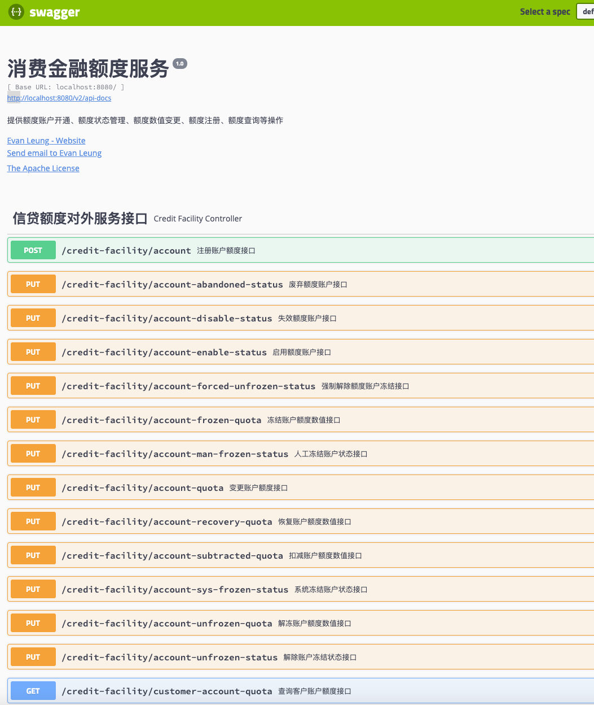

# 用户指南

# Quickstart 快速开始
1.在根目录执行```mvn clean -U install``` 进行构建

2.启动Start包下的 application程序

3.在浏览器访问 http://localhost:8080/swagger-ui.html


4。通过以下URL可以进入H2控制台进行表操作
http://localhost:8080/h2/

***
# 项目说明
***
# DEMO请求参数

1.注册额度账户接口请求参数
```json
{
	"registrationLimitCO": {
		"applicationId": "1111",
		"userId": 1111,
		"quotaLimit": 1111,
		"productCode": "tb",
		"expirationTime": "2030-01-01",
		"cardType": 1
	}

}
```